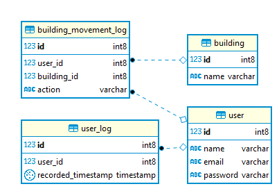

# liquibase-preconditions-contexts-labels
This sample application demostrates the usage of preconditions, contexts and labels in liquibase.

## Prerequisites
- Liquibase - 3.8
- PostreSQL JDBC driver (for postgreSQL Database; for other databases use other compatible drivers)

## Schema Details


This application has the scripts to create these tables, relations and add dummy data.
The scripts are configured to cater to 3 environments,
- Development environment - has database constraints.
- Test environment - has database constraints, has fake data.
- Production environment - does not have database constraints.

## Configuration
1. Update the following parameters in the *liquibase.properties* file
    - url
    - username
    - password
    - classpath
    - driver (incase a different database is used)
2. A dbms precondition has been configured in the *master.changelog.xml* to run the liquibase changelogs only on postgreSQL database. You can change it to your particular database.

## Execution
To apply the changes to an existing database, run the following command in the base directory of the project.
```
liquibase update
```
This will run all the changesets.
To run a the changesets for a particular environment, specify the particular context,
```
liquibase --contexts=dev,test update
```

## Licence
This project uses the following license: MIT License